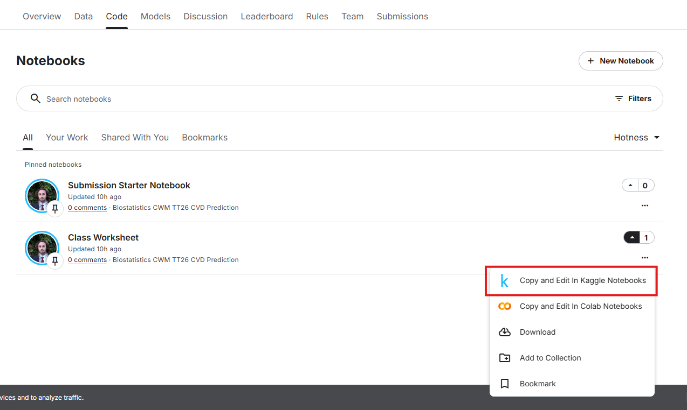

# Welcome

This course includes practical coding exercises that allow you to apply the biostatistics concepts introduced throughout the course.

You can access and run the course code in **two different ways**:

1. **Kaggle (Recommended)**
2. **Google Colab**

Both platforms run entirely in your web browser, so you do **not** need to install Python or any special software on your computer.

---

# Option 1: Kaggle (Recommended)

Kaggle serves two purposes in this course:

1. It provides an online environment where you can run the course code directly in your browser.
2. It hosts an optional extension challenge for students who would like to explore predictive modelling beyond the core course material.

Most students will primarily use Kaggle as a platform for running the course notebooks and completing practical exercises.

## Why use Kaggle?

Kaggle is the easiest option for beginners because:

- You can create an account using **any email address**.
- No software installation is required.
- The coding environment is already prepared for you.
- Your work is saved online.
- Most students can start coding within a few minutes.

For this reason, **we recommend that all students start with Kaggle unless they already have experience using Google Colab.**

## Step 1: Create a Kaggle account

Open the course competition page:

👉 **[Biostatistics CWM TT 26 CVD Prediction Competition](https://www.kaggle.com/competitions/biostatistics-cwm-tt-26-cvd-prediction)**

If you do not already have a Kaggle account:

1. Click **Register**.
2. Sign up using any email address.
3. Verify your email if requested.
4. Sign in to Kaggle.

If you already have a Kaggle account, click **Sign In**.

## Step 2: Open a notebook

Within Kaggle:

1. Click on the **code**.
2. Select **Class Worksheet** and click **Copy and Edit in Kaggle Notebooks**.
{fig-align="center" width="80%"}
3. Wait for Kaggle to initialise.

## Step 3: Run the code

The notebook is divided into small sections called **cells**. A cell may contain code, instructions, explanations, or outputs. You can run each code cell individually, allowing you to execute and understand the notebook step by step.

To run a code cell:

1. Click on the cell.
2. Press the **Run** button.
3. Wait for the output to appear.

Do not worry if you do not understand every line of code immediately. The goal is to learn gradually throughout the course.

## Tips for beginners

✅ Run cells from top to bottom.

✅ Read all instructions before running code.

✅ Save your work regularly.

✅ If an error occurs, check whether all previous cells have been run.

❌ Do not delete cell unless instructed to do so.

---

# Option 2: Google Colab

## When should I use Colab?

Google Colab is another online coding environment.

You may prefer Colab if:

- You already use Google Drive frequently.
- You want to save notebooks directly to your Google account.
- You have previous experience using Colab.

## Important requirement

Unlike Kaggle, **Google Colab requires a Google account**.

You cannot use a non-Google email address to sign in.

## Step 1: Open Google Colab

Go to:

👉 **[Google Colab](https://colab.research.google.com/)**

Sign in using your Google account.

## Step 2: Access the course code

The course code is hosted on GitHub:

👉 **[Biostatistics Course GitHub Repository](https://github.com/MultiMeDIA-Oxford/Biostatistics_code)**

You can browse the repository and view all notebooks and supporting files.

## Step 3: Import notebooks into Colab

Within Colab:

1. Click **File → Open Notebook**.
2. Select the **GitHub** tab.
3. Paste the repository URL:
https://github.com/MultiMeDIA-Oxford/Biostatistics_code

4. Choose the notebook you would like to open.
5. Open it in Colab.

## Step 4: Save your own copy

Before making changes:

1. Click **File → Save a copy in Drive**.
2. Work on your own copy rather than editing the original notebook.

## Step 5: Run the notebook

Run the notebook from top to bottom, just as you would in Kaggle.

---

# Optional Kaggle Extension Challenge

After completing the core course activities, you may wish to take part in the optional Kaggle Extension Challenge.

Participation is completely voluntary and is **not required** for completing the course.

The challenge is designed for students who would like to explore data analysis and predictive modelling in greater depth.

### What is the challenge about?

The Extension Challenge builds upon the concepts introduced in the **Meet the Dataset** section of the course.

Rather than focusing only on descriptive statistics, participants are encouraged to investigate relationships within the data and develop predictive models using real-world biostatistical indicators.

Students will have the opportunity to:

- Explore the dataset independently
- Formulate their own analytical questions
- Experiment with predictive modelling approaches
- Compare the performance of different methods
- Gain experience with a realistic biomedical data science workflow

### Who should participate?

The challenge is intended for students who:

- Enjoy working with data
- Would like additional practice beyond the course exercises
- Are interested in machine learning or predictive modelling
- Want to further develop their programming and analytical skills

### How do I join?

The challenge is hosted on the same Kaggle competition page used throughout the course:

👉 [Biostatistics CWM TT 26 CVD Prediction Competition](https://www.kaggle.com/competitions/biostatistics-cwm-tt-26-cvd-prediction)

You may participate at any time after registering for Kaggle.

::: {.callout-note}
The Extension Challenge is optional. You do not need to participate in order to complete the course.
:::

  <a class="nav-button previous" href="index.html">← Return to Home</a>
  <a class="nav-button next" href="why-biostatistics.html">Next: Why Biostatistics? →</a>

